# HashBanger Documentation

## Hardware Architecture Diagram
System is a network of interconnected worker nodes, that exchange information about current status of a problem and work that has to be done in order to solve it.
To establish a connection between nodes, central server is used which itself is not a part of problem communication.

## Logic Architecture - Class Diagram

Main parts of the solutions are:
    - Problem
    - Thread management and encryption
    - Network communication

#### Problem
Problem contains actual state of finish, and stores the updates made by other peers, as well as the peer itself.

It is responsible for managing the problem - it keeps all done and reserved ranges of solution. Anyone can access problem to get it.

#### Network Communication

#### Thread Management and Encryption
This part is resposnible for actually solving the problem.
It takes possible unchecked combination and schedule threads task to try them.

At the end it notifies Problem part about the progress

```mermaid
classDiagram
    class DataIndexer{
        +static string FromIndex(int index)
        +static int ToIndex(string data)
    }
    class EncrypterFactory{
        +static IEncrypter CreateEncrypter(EncryptionType encryptionType)
    }
    class IEncrypter {
        +abstract string Encrypt(string data)
    }
    <<interface>> IEncrypter
    class SHA1Encrypter{
        +string Encrypt(string data)
    }
    class EncryptionTask{
        +TaskRange Range
        +ProblemArgs ProblemArgs
        +CancellationToken Token
        -TaskManager _manager
        -IEncrypter _encrypter

        +EncryptionTask(TaskManager manager, TaskRange range, IEncrypter encrypter, ProblemArgs, problemArgs, CancellationToken token)
        +void Start()
    }
    class Subscriber{
        #Problem problem
        #ProblemUpdateVisitor visitor

        +void Poke()
    }
    <<abstract>> Subscriber
    class Observable{
        -List<Subscriber> subscribers
        +void Subscribe(Subscriber subscriber)
        +void PokeAllSubscribers()
    }
    <<abstract>> Observable
    class Problem{
        +ConcurrentDictionary<ProblemUpdate, byte> Updates
        +ProblemArgs? Args
        +TaskRangeIterator Iterator

        +Problem(TaskRangeIterator iterator)
        +void Update(ProblemUpdate problemUpdate)
        +TaskRange GetNewRange(object? source)
        +void GotNewProblem(object? source, NewProblemArgs newProblemArgs)
        +void ReserveRange(object? source, TaskRange range)
        +void ProblemSolved(object? source, string result)
        +void RangeDone(object? source, TaskRange range)
    }
    class ProblemArgs{
        +string ProblemHash
        +EncryptionType EncryptionType
        +bool IsDone
        +string Result

        +ProblemArgs(string problemHash, EncryptionType encryptionType)
    }
    class ProblemUpdate{
        +object? Source
        +ConcurrentDictionary<object, byte> Acknowledgements

        +abstract void Accept(ProblemUpdateVisitor visitor)
        +bool Acknowledge(object obj)
    }
    <<abstract>> ProblemUpdate
    class ProblemUpdateVisitor{
        +void Visit(RangeReservationUpdate update)
        +void Visit(RangeDoneUpdate update)
        +void Visit(NewRangeCollectionUpdate update)
        +void Visit(NewProblemUpdate update)
        +void Visit(ProblemSolvedUpdate update)
    }
    <<interface>> ProblemUpdateVisitor
    class MessageHandlerProblemUpdateVisitor{
        -MessageHandler _messageHandler

        +MessageHandlerProblemUpdateVisitor(MessageHandler messageHandler)
        +void Visit(RangeReservationUpdate update)
        +void Visit(RangeDoneUpdate update)
        +void Visit(NewRangeCollectionUpdate update)
        +void Visit(NewProblemUpdate update)
        +void Visit(ProblemSolvedUpdate update)
    }
    class TaskManagerProblemUpdateVisitor{
        -TaskManager _taskManager

        +TaskManagerProblemUpdateVisitor(TaskManager taskManager)
        +void Visit(RangeReservationUpdate update)
        +void Visit(RangeDoneUpdate update)
        +void Visit(NewRangeCollectionUpdate update)
        +void Visit(NewProblemUpdate update)
        +void Visit(ProblemSolvedUpdate update)
    }
    class CollectionManagerProblemUpdateVisitor{
        -TaskRangeCollectionManager _collectionManager

        +CollectionManagerProblemUpdateVisitor(TaskRangeCollectionManager collectionManager)
        +void Visit(RangeReservationUpdate update)
        +void Visit(RangeDoneUpdate update)
        +void Visit(NewRangeCollectionUpdate update)
        +void Visit(NewProblemUpdate update)
        +void Visit(ProblemSolvedUpdate update)
    }
    class TaskManager{
        -readonly object _lock
        -Dictionary<EncryptionTask, Thread> _runningTasks
        -Dictionary<EncryptionTask, CancellationTokenSource> _cancellationTokens

        +TaskManager(Problem problem)
        +void ScheduleTask()
        -void ReplaceTask(EncryptionTask task)
        +void TaskDone(EncryptionTask task, TaskResult result)
        +void CancelAllTasks()
        +void ReplaceConflictingTasks(TaskRange range)
        +void StartTasks()
    }
    class TaskRange{
        +int Start
        +int End

        +TaskRange(int start, int end)
        +int CompareTo(TaskRange other)
        +bool Equals(object obj)
    }
    class ReservedRange{
        +DateTime ReservedAt

        +ReservedRange(int start, int end, DateTime reservedAt)
        +bool Equals(object obj)
    }
    class RangeSortedList{
        +RangeSortedList()
        +void Add(TaskRange range)
        +void Add(int start, int end)
        +void Remove(TaskRange range)
        +TaskRange this(int index)
    }
    class TaskRangeIterator{
        +TaskRangeCollection TaskRangeCollection

        +TaskRange GetNext()
    }
    <<abstract>> TaskRangeIterator
    class RandomTaskRangeIterator{
        +TaskRangeCollection TaskRangeCollection

        +RandomTaskRangeIterator(TaskRangeCollection taskRangeCollection)
        +TaskRange GetNext()
    }
    class TaskRangeCollection{
        +RangeSortedList AvailableRanges
        +RangeSortedList ReservedRanges
        +List<TaskRange> SerializableAvailableRanges
        +List<ReservedRange> SerializableReservedRanges

        +TaskRangeCollection()
        +void MergeRanges()
        +void ReserveRange(TaskRange range)
        +void FreeExpiredReservedRanges()
        +void FreeReservedRange(TaskRange range)
        +void RemoveReservedRange(TaskRange range)
        +void Reset()
    }
    class TaskRangeCollectionManager{
        +TaskRangeCollection RangeCollection

        +TaskRangeCollectionManager(Problem problem, TaskRangeCollection rangeCollection)
        +void ReserveRange(TaskRange range)
        +void RemoveReservedRange(TaskRange range)
        +void Reset()
    }
    class TaskResult{
        +TaskStatus Status
        +string? Result
        +TaskRange Range

        +TaskResult(TaskStatus status, string? result, TaskRange range)
    }
    class TaskStatus{
        Found
        NotFound
    }
    <<enum>> TaskStatus
    class EncryptionType{
        SHA1
    }
    <<enum>> EncryptionType
    class LocalPeer{
        -readonly NetPeer _peer
        +delegate void MessageReceivedEventHandler(string message)
        +event MessageReceivedEventHandler MessageReceived

        -void ProcessNet
        +LocalPeer()
        +Register()
        +BroadcastMessage(Message msg)
        +void SendMessage(NetConnection receiver, Message msg)
        +Message CreateMessage(MessageType type, string content)
        +void NodeConnected(NewNodeConnectedArgs args)
        +void NodeDisconnected(NodeDisconnectedArgs args)
        +void NodesReceived(NodesReceivedArgs args)
    }
    class Message{
        +MessageType Type
        +string Content

        +Message(MessageType type, string content)
    }
    class MessageType{
        Hello,
        NewNodeConnected,
        NodeDisconnected,
        NodesReceived,
        NewProblem,
        CancelProblem,
        ProblemSolved,
        RangeStarted,
        RangeCompleted,
    }
    <<enum>> MessageType
    class MessageHandler{
        -readonly LocalPeer _localPeer
        
        +MessageHandler(LocalPeer localPeer, Problem problem)
        -void HandleMessage(string newMessage)
        +void BroadcastResult(string result)
        +void BroadcastRangeDone(TaskRange range)
        +void BroadcastRangeReservation(TaskRange range)
        +void BroadcastNewProblem()
        +void SendProblemToNewNode(NetConnection connection)
        +static Message Deserialize(string message)
        +static string Serialize(Message message)
    }
    class CancelProblemArgs
    class NewNodeConnectedArgs{
        +string Socket

        +NewNodeConnectedArgs(string socket)
    }
    class NewProblemArgs{
        +string ProblemHash
        +EncryptionType EncryptionType
        +TaskRangeCollection? RangeCollection

        +NewProblemArgs(string problemHash, EncryptionType encryptionType, TaskRangeCollection? rangeCollection)
    }
    class NodeDisconnectedArgs{
        +string Socket

        +NodeDisconnectedArgs(string socket)
    }
    class NodesReceivedArgs{
        +List<string> Sockets

        +NodesReceivedArgs(List<string> sockets)
    }
    class ProblemSolvedArgs
    class RangeCompletedArgs
    class RangeStartedArgs
    class Settings{
        +const int DefaultPort
        +static int Port
    }
    class ProblemParameters{
        +static TimeSpan EXPIRATION_DELTA
        +static int MAX_TASKS
        +static string PASSWORD
        +static int DATA_LENGTH
        +static TaskRange DEFAULT_RANGE
        +static int CHUNK_LENGTH

        +static void UpdatePassword(string newPassword)
    }
    

    IEncrypter <|.. SHA1Encrypter
    EncrypterFactory ..> EncryptionType
    EncrypterFactory --> IEncrypter

    EncryptionTask --> TaskRange
    EncryptionTask --> ProblemArgs
    EncryptionTask --> TaskManager
    EncryptionTask --> IEncrypter

    MessageHandler <|-- Subscriber
    TaskManager <|-- Subscriber
    TaskRangeCollctionManager <|-- Subscriber

    Subscriber --> Problem
    Subscriber --> ProblemUpdateVisitor

    Problem <|-- Observable
    
    Observable --> Subscriber

    Problem --> ProblemUpdate
    Problem --> TaskRangeIterator
    Problem --> ProblemArgs

    ProblemArgs --> EncryptionType

    MessageHandlerProblemUpdateVisitor ..|> ProblemUpdateVisitor
    MessageHandlerProblemUpdateVisitor --> MessageHandler
    TaskManagerProblemUpdateVisitor ..|> ProblemUpdateVisitor
    TaskManagerProblemUpdateVisitor --> TaskManager
    CollectionManagerProblemUpdateVisitor ..|> ProblemUpdateVisitor
    CollectionManagerProblemUpdateVisitor --> TaskRangeCollectionManager

    TaskManager --> EncryptionTask
    TaskManager --> TaskRange

    ReservedRange <|-- TaskRange

    RangeSortedList o-- TaskRange

    TaskRangeIterator --> TaskRangeCollection

    RandomTaskRangeIterator <|-- TaskRangeIterator

    TaskRangeCollection --> RangeSortedList

    TaskRangeCollectionManager --> TaskRangeCollection

    TaskResult --> TaskRange
    TaskResult --> TaskStatus

    LocalPeer --> Message

    Message --> MessageType

    MessageHandler --> LocalPeer
    MessageHandler --> Problem

    Message --> CancelProblemArgs
    Message --> NewNodeConnectedArgs
    Message --> NewProblemArgs
    Message --> NodeDisconnectedArgs
    Message --> NodesReceivedArgs
    Message --> ProblemSolvedArgs
    Message --> RangeCompletedArgs
    Message --> RangeStartedArgs
    
```

## Used Design Patterns

### Observer Pattern

In this case observer pattern helps in decoupling the Problem from MessageHandler and TaskManager, so the problem keeps being separated from network connection and thread management system parts.

It assures scalability of the solution, because it is easy to access the problem.

Thanks to this solution we can easily add runtime statistics system or GUI.  

### Strategy Pattern

In this case strategy patern assures capability for future use case extensions. It allows to easily implement new hash methods.

Architecture is able to easily swap encryption methods for problems.

### Factory Pattern
In this case factory patterns is strongly combined with strategy pattern. Architecture allows easy creation of specific Encryptors for the problem.

It makes future extensions even more easy to implement.

### Iterator Pattern
Our solution uses iterator pattern to manage the ranges of tasks. It allows to easily iterate over the ranges of tasks.

The elasticity of the iterator pattern allows to easily implement new types of iterators, for example random iterator or more complex ones, leveraging probability distributions over the most likely password combinations.

### Visitor Pattern
The implementation of the visitor pattern was motivated by the need to separate the problem update handling logic from the problem update class itself. This allows for easy extension of the problem update handling logic, as well as for easy testing of the problem update handling logic.

